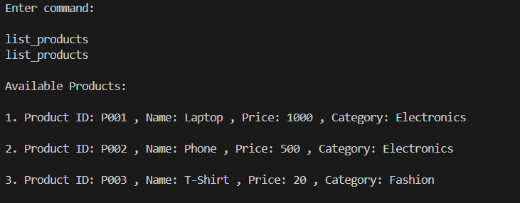
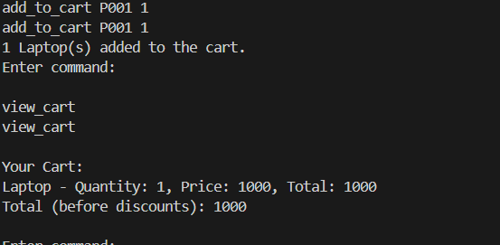
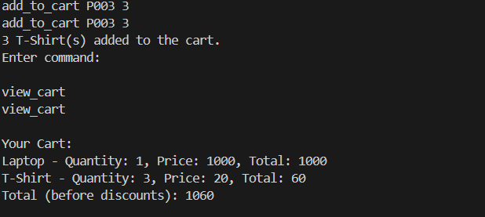
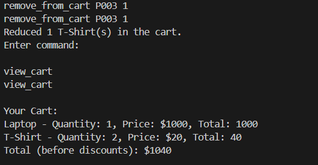
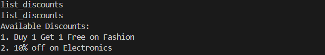
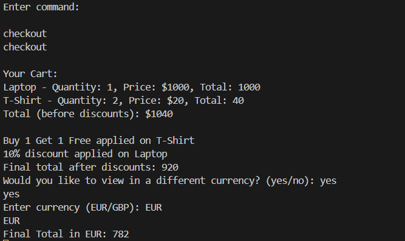

# Mini E-commerce Cart System

This is a simple command-line application that simulates a Mini E-commerce Cart System. Users can add/remove products to/from the cart, view the cart, apply discounts, and check out. The application is built using **Node.js** and uses **Nodemon** for development.

## Features

- Add products to the cart
- Remove products from the cart
- View current items in the cart
- Calculate the total price, with support for multiple currencies
- Apply discounts automatically at checkout
- Currency conversion (USD to EUR or GBP)

## Project Setup

### 1. Prerequisites

Before starting, ensure you have **Node.js** installed on your machine. If not, download and install it from [nodejs.org](https://nodejs.org).

### 2. Cloning the Project

Clone the repository to your local machine.

```bash
git clone <repository-url>
cd mini-ecommerce-cart
```

<h3>OR </h3>

- Download the zip file and un-zip it
- move the command-line to the root of the folder where, index.js file stored.

### 3. Install Dependencies

After cloning the project, install the required dependencies using npm. This will also install Nodemon, a tool that automatically restarts the application when file changes are detected.

```bash
npm install
```

This command installs the following dependencies:

<b>Nodemon: </b> For automatically restarting the server during development.

### 4. Running the Application

To start the application, use Nodemon. This will allow you to make changes and see them in action without restarting the app manually.

```bash
nodemon index.js
```

The application will start and await user commands for interacting with the cart system.

### 5. Available Commands

Once the application is running, you can use the following commands to interact with the system:

- List the products

  ```bash
  list_products
  ```

  Output:
  

- Add items to the cart:

  ```bash
  add_to_cart <productId> <quantity>
  ```

  Output:
  
  

- Remove items from the cart:

  ```bash
  remove_from_cart <productId> <quantity>
  ```

  Output:
  

- View the current cart:

  ```bash
  view cart
  ```

- List Available Discounts:

  ```bash
  list_discounts
  ```

  Output:
  

- Checkout and Currency Conversion:

  ```bash
  checkout
  ```

  Cureency Conversion:
  During checkout, you can choose to view the total price in EUR or GBP. The following conversion rates are used:

  - USD to EUR: 0.85
  - USD to GBP: 0.75

  Output:
  

### 6. Adding More Products

If you want to add more products to the catalog, you can modify the products array in index.js.

```javascript
const products = [
  new Product("P001", "Laptop", 1000.0, "Electronics"),
  new Product("P002", "Phone", 500.0, "Electronics"),
  new Product("P003", "T-Shirt", 20.0, "Fashion"),
];
```
